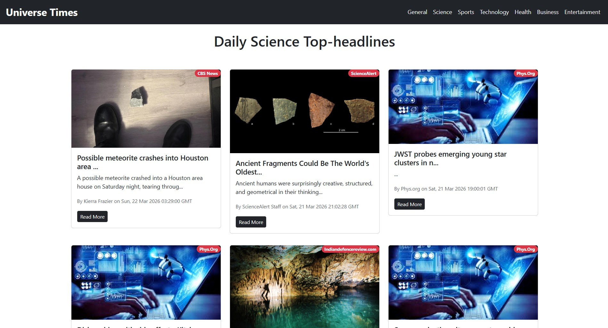
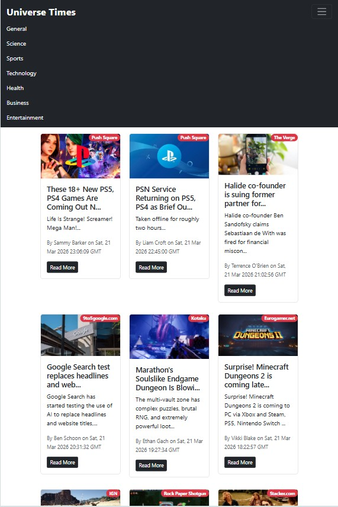

# 📰 NewsAPI - React News App

NewsAPI is a modern React-based news application that provides users with the latest headlines from around the world. It fetches real-time news using an API and displays them category-wise with a smooth user experience.

---

## 🚀 Features

* 🌍 Latest news from multiple categories:

  * General
  * Business
  * Entertainment
  * Health
  * Science
  * Sports
  * Technology
* ⚡ Real-time news updates using API
* 📊 Top loading progress bar for better UX
* 🔄 Dynamic routing using React Router
* 📱 Responsive design
* 🔐 API key secured using environment variables

---

## 🛠️ Tech Stack

* ⚛️ React.js
* 🧭 React Router DOM
* 📡 News API
* 🎨 CSS / Bootstrap
* 📊 react-top-loading-bar

---

## 📂 Project Structure

```
NewsMonkey/
|── assets/
│── public/
│── src/
│   ├── components/
│   │   ├── NavBar.js
│   │   ├── News.js
│   │   ├── NewsItem.js
│   ├── App.js
│   └── index.js
```

---

## ⚙️ Installation & Setup

Follow these steps to run locally:

```bash
# Clone the repository
git clone https://github.com/your-username/newsmonkey.git

# Navigate into the folder
cd newsmonkey

# Install dependencies
npm install

# Create a .env file in root
REACT_APP_NEWS_API_KEY=your_api_key_here

# Start the app
npm start
```

---

## 🔑 Environment Variables

Create a `.env` file in the root directory:

```
REACT_APP_NEWS_API_KEY=your_api_key_here
```

👉 You can get your API key from: https://newsapi.org/

---

## 🌐 Usage

* Navigate through categories using the navbar
* Browse latest headlines instantly
* Loading bar indicates data fetching progress

---

## 📸 Screenshots

### Main Page


### Scroll-down Mode


### Change Dimension


---

## 🔮 Future Improvements

* 🔍 Search functionality
* 🌐 Country selection
* ⭐ Bookmark/save articles
* 📰 Infinite scroll optimization
* 🌙 Dark mode

---

## 🤝 Contributing

Contributions are welcome!

1. Fork the repo
2. Create a new branch
3. Make your changes
4. Submit a pull request

---

## 👨‍💻 Author

**Shubham Rajay Sarate**
GitHub: https://github.com/ShubhamSarate

---

## 🙌 Acknowledgements

* News data provided by NewsAPI
* Built as a React learning project

---
